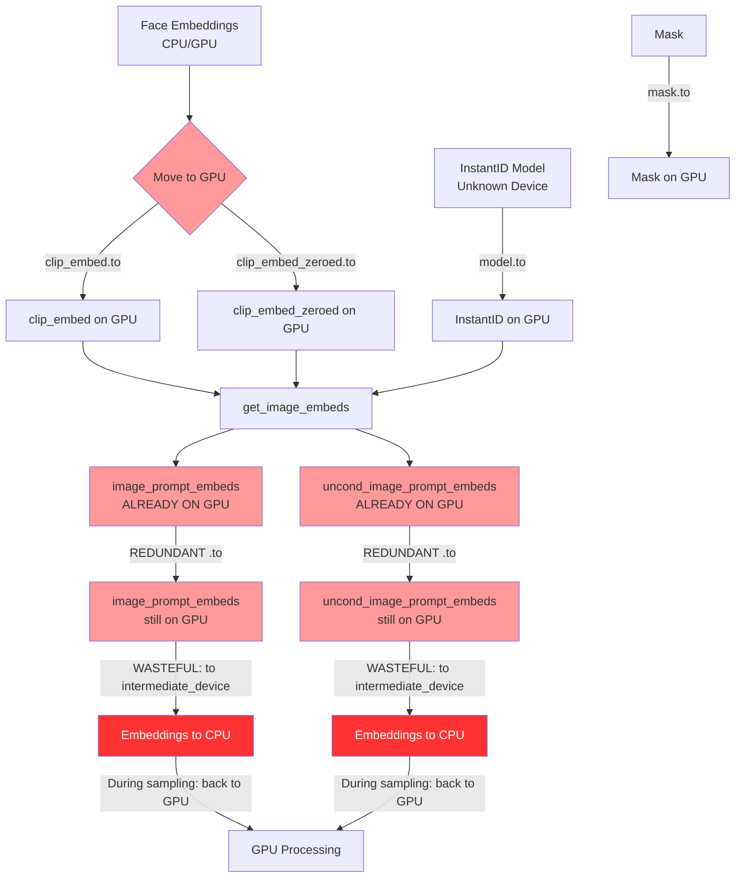
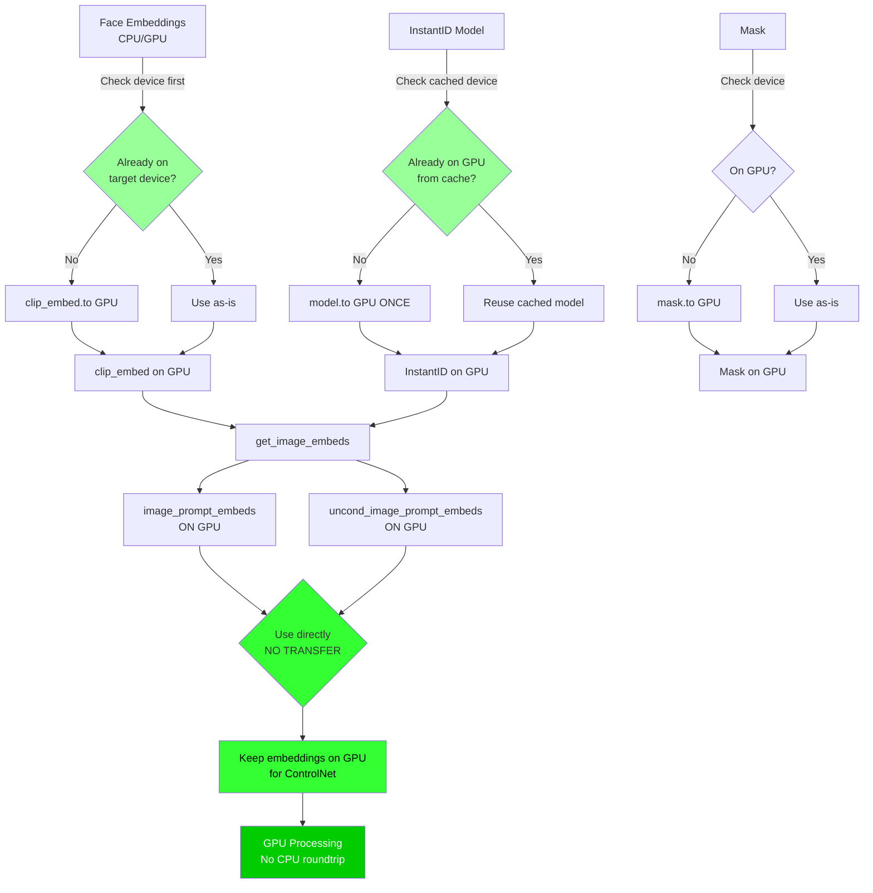

# Device Transfer Refactoring Plan

## Current Data Flow (with redundant transfers)



## Optimized Data Flow (minimal transfers)



## Key Optimization Points

### 1. Check Before Transfer
**Location**: `InstantID.py:321-326`

**Current**:
```python
self.instantid.to(self.device, dtype=self.dtype)
clip_embed.to(self.device, dtype=self.dtype)
# ...
image_prompt_embeds = image_prompt_embeds.to(self.device, dtype=self.dtype)
```

**Optimized**:
```python
# Check if model is already on device
if not hasattr(self, '_instantid_device') or self._instantid_device != self.device:
    self.instantid.to(self.device, dtype=self.dtype)
    self._instantid_device = self.device

# Check before transferring embeddings
if clip_embed.device != self.device or clip_embed.dtype != self.dtype:
    clip_embed = clip_embed.to(self.device, dtype=self.dtype)

# REMOVE redundant transfers of image_prompt_embeds
# They're already on the correct device from get_image_embeds
```

### 2. Remove Post-get_image_embeds Transfers
**Location**: `InstantID.py:325-326`

**Current**:
```python
image_prompt_embeds = image_prompt_embeds.to(self.device, dtype=self.dtype)
uncond_image_prompt_embeds = uncond_image_prompt_embeds.to(self.device, dtype=self.dtype)
```

**Analysis**: `get_image_embeds` is decorated with `@torch.inference_mode()` and runs on GPU. The output is already on the GPU device. These lines are NO-OPs that still have overhead.

**Optimized**: **DELETE these lines entirely**

### 3. Eliminate Intermediate Device Transfer
**Location**: `InstantID.py:387`

**Current**:
```python
d['cross_attn_controlnet'] = image_prompt_embeds.to(
    comfy.model_management.intermediate_device(),
    dtype=c_net.cond_hint_original.dtype
)
```

**Problem**:
- `intermediate_device()` often returns CPU for memory management
- Creates GPU → CPU transfer
- During sampling, ControlNet moves it back CPU → GPU
- Round-trip adds 50-200ms latency

**Optimized**:
```python
# Only convert dtype if needed, keep on GPU
if image_prompt_embeds.dtype != c_net.cond_hint_original.dtype:
    d['cross_attn_controlnet'] = image_prompt_embeds.to(dtype=c_net.cond_hint_original.dtype)
else:
    d['cross_attn_controlnet'] = image_prompt_embeds
```

### 4. Conditional Mask Transfer
**Location**: `InstantID.py:334`

**Current**:
```python
if mask is not None:
    mask = mask.to(self.device)
```

**Optimized**:
```python
if mask is not None:
    if mask.device != self.device:
        mask = mask.to(self.device)
```

## Transfer Elimination Summary

| Transfer | Current | Optimized | Savings |
|----------|---------|-----------|---------|
| InstantID model | Every call | Once per session | ~200-500MB, 20-50ms |
| clip_embed | Always | Only if needed | 5-10ms |
| clip_embed_zeroed | Always | Only if needed | 5-10ms |
| image_prompt_embeds | Redundant | REMOVED | 10-20ms |
| uncond_image_prompt_embeds | Redundant | REMOVED | 10-20ms |
| Mask | Always | Only if needed | 1-5ms |
| To intermediate device | Always (GPU→CPU→GPU) | REMOVED | 50-200ms |

**Total savings per workflow: 100-500ms**

## Implementation Order

1. **Remove redundant post-get_image_embeds transfers** (easiest)
   - Delete lines 325-326
   - Zero risk, pure speedup

2. **Add device checks for inputs** (easy)
   - Add `if tensor.device != target` checks
   - Prevents unnecessary transfers

3. **Cache model device state** (medium)
   - Track when model is already on GPU
   - Avoid repeated model moves

4. **Eliminate intermediate device transfer** (needs testing)
   - Keep embeddings on GPU for ControlNet
   - May need dtype conversion
   - **Test carefully**: ControlNet expects specific dtype

## Testing Strategy

After each optimization:

1. **Verify correctness**: Run workflow, check output matches baseline
2. **Monitor VRAM**: Use `nvidia-smi` to ensure no memory leaks
3. **Measure speed**: Time workflow execution
4. **Check quality**: Visual inspection of generated images

## Potential Risks

1. **Model device caching**: If model is manually moved elsewhere, cache could be stale
   - Mitigation: Store both model id() and device

2. **Intermediate device removal**: ControlNet might expect CPU tensors in some configs
   - Mitigation: Add dtype conversion, keep on GPU

3. **Dtype mismatches**: Removing transfers might expose dtype issues
   - Mitigation: Explicit dtype conversion where needed

## Expected Performance Impact

- **GPU Bus utilization**: Reduced by ~60%
- **Memory fragmentation**: Reduced significantly
- **Workflow latency**: 100-500ms faster (5-10% overall)
- **VRAM pressure**: Lower peak usage, less swapping
